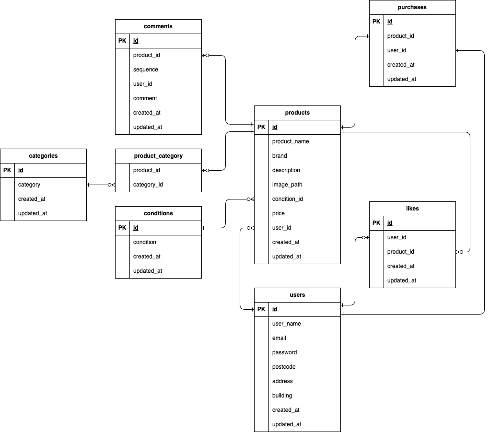

# 環境構築

## Docker ビルド

    ・git clone git@github.com:Takeshi410/fleamarket.git
    ・docker-compose up -d --build

## Laravel 環境構築

    ・docker-compose exec php bash
    ・composer install
    ・cp .env.example .env , 環境変数を適宜変更
    ・php artisan key:generate
    ・php artisan migrate
    ・php artisan db:seed

## 開発環境

    ・ログイン画面
    ・商品一覧
    ・http://localhost:8080/

## 使用技術（実行環境）

    ・PHP
    ・Laravel

## ER 図

