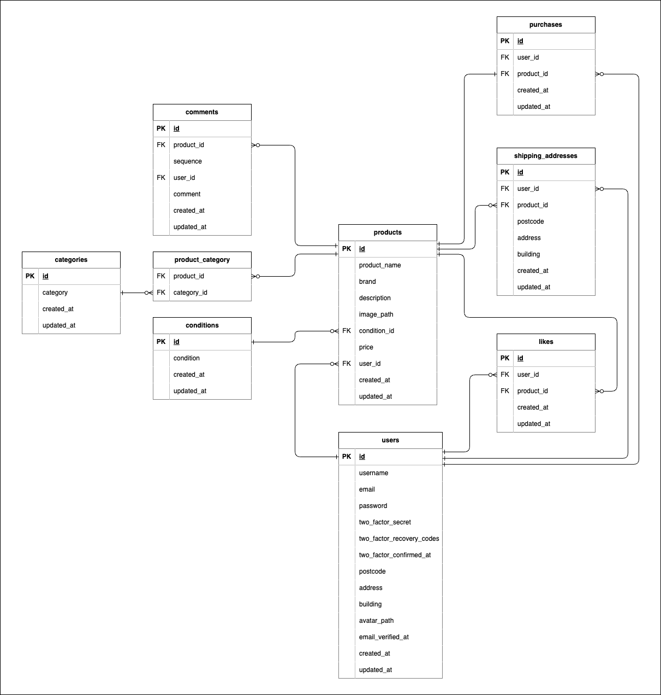

# 環境構築

## Docker ビルド

    git clone git@github.com:Takeshi410/fleamarket.git
    docker-compose up -d --build

## Laravel 環境構築

    docker-compose exec php bash
    composer install
    composer require stripe/stripe-php
    cp .env.example .env

### .envファイルの環境変数を適宜変更し下記コマンドを実行

    php artisan key:generate
    php artisan migrate
    php artisan db:seed

## 開発環境

    商品一覧(トップ画面)：http://localhost
    phpmyadmin：http://localhost:8080/
    mailhog：http://localhost:8025/

## 使用技術（実行環境）

    ・PHP 8.1.34
    ・Laravel 8.83.29
    ・nginx 1.21.1
    ・MySQL 8.0.26
    ・phpmyadmin
    ・mailhog

## ER 図

